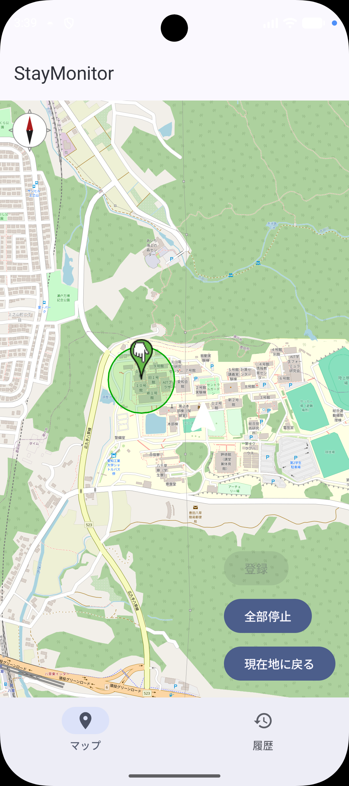
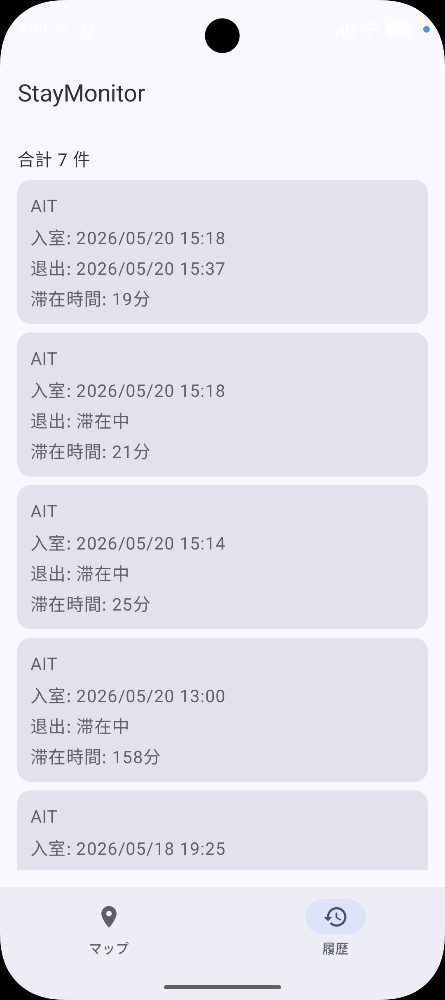
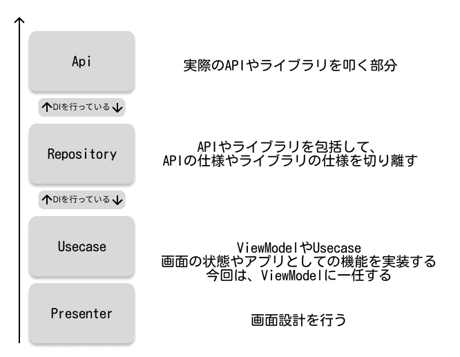

StayMonitor (滞在管理アプリ)
===





## 概要
OpenStreetMap 上にユーザーが指定したピンを中心とした 半径100m の Geofence を作成し、
そのエリアへの **入室 / 退出** を自動で Room データベースに記録するアプリです。
あとから「いつ・どの場所に・どれくらい滞在したか」を一覧で確認することができます。

## アプリの主な特徴
- **手動で地図にピンを打つだけで滞在計測がスタート**
  - OpenStreetMap (osmdroid) 上をタップしてピンを設置
  - そのピンを中心に 半径100m の Geofence を自動生成
- **滞在の記録は完全自動**
  - Google Play Services の Geofence API を利用
  - エリアに入った瞬間 (ENTER) と出た瞬間 (EXIT) を BroadcastReceiver でキャッチし、
    Room DB の滞在履歴テーブルに保存
- **履歴をいつでも確認可能**
  - 場所ごと / 日付ごとに滞在ログを一覧表示
  - 滞在開始時刻・退出時刻・滞在時間を確認できる
- **バックグラウンドでも動作**
  - アプリを開いていなくても Geofence のイベントを受信できる
    (ACCESS_BACKGROUND_LOCATION 権限を利用)

## ユースケース
- 自宅・会社・カフェなど、よく行く場所への滞在時間を自動で記録したい
- ジオフェンスベースのライフログ・行動分析のサンプル実装が欲しい
- Google Geofence API と Room を組み合わせた実装例を学びたい

## 画面構成 (予定)
| 画面 | 役割 |
| --- | --- |
| 地図画面 | OpenStreetMap を表示し、ピンの設置・Geofence の開始/停止を行う |
| 履歴画面 | Room DB に保存された入室/退出ログを時系列で表示する |
| 設定画面 (予定) | Geofence の半径や通知の有無を変更する |

## アーキテクチャ
このプロジェクトは [NationalWeather テンプレート](./README.md) をベースにしており、
以下のアーキテクチャを踏襲します。

- **MVVM + Clean Architecture**
- **Feature-First** のディレクトリ構成
  - `features/geofence` — Geofence 登録 / 解除 / BroadcastReceiver
  - `features/stayLog`  — 滞在履歴の Room エンティティ / DAO / Repository
  - `features/map`      — osmdroid を使った地図表示・ピン操作
  - `core/presenter`    — 画面 (Compose) と ViewModel
- Repository / UseCase 間は DI を意識しており、Mock 化テストが行いやすい



## 動作の仕組み
1. ユーザーが地図画面でピンを設置する
2. `GeofencingClient.addGeofences()` で 半径100m の Geofence を登録
   - トリガー: `GEOFENCE_TRANSITION_ENTER` / `GEOFENCE_TRANSITION_EXIT`
3. エリア境界を跨ぐと OS が `GeofenceBroadcastReceiver` を起動
4. Receiver で遷移タイプを判定し、Room DB に滞在ログを INSERT
   - ENTER → 新しい滞在レコードを作成 (`enteredAt` を記録)
   - EXIT  → 直近の未終了レコードに `exitedAt` を書き込み
5. 履歴画面で `Flow<List<StayLog>>` を購読して一覧描画

## バージョン関係
- org.jetbrains.kotlin.android 2.1.20
- Java 17 (テンプレートは 21 ですが Geofence 連携の都合で揃える可能性あり)
- Android Studio Meerkat | 2024.3.1 Patch 1
- minSdk 27 / targetSdk 37

## 主なライブラリ構成
- **Google Play Services Location** — Geofence API
- **osmdroid** — OpenStreetMap 表示
- **Room** — 滞在ログのローカル DB
- **Jetpack Compose** — UI
- **navigation-compose** — 画面遷移
- **lifecycle-viewmodel-compose** — ViewModel
- **Retrofit2 / Moshi** — (将来的に外部 API 連携する場合に備えてテンプレートから継承)
- **coil** — 画像表示
- **material-icons-extended** — アイコン

## 必要な権限
| 権限 | 用途 |
| --- | --- |
| `ACCESS_FINE_LOCATION` | 高精度の現在地取得 |
| `ACCESS_COARSE_LOCATION` | 大まかな現在地取得 |
| `ACCESS_BACKGROUND_LOCATION` | アプリ非表示中も Geofence を動作させるため |
| `POST_NOTIFICATIONS` | 入退室時の通知 (任意機能) |
| `INTERNET` / `ACCESS_NETWORK_STATE` | OpenStreetMap タイル取得 |

## 参考実装
Geofence の実装は以下のリポジトリの構成を参考にしています。
- https://github.com/harutiro/GMOGeofence

## linter について
このプロジェクトは ktlint を用いて静的コード解析を行なっています。
パッケージ名に "_" を使うのは許可するものとしています。

```bash
# 自動でフォーマットをかける
make ktlint-format

# コードのルール違反をチェックする
make ktlint-check
```

## パッケージ名の変更方法
以下の URL が参考になります。
https://codeforfun.jp/android-studio-how-to-change-package-name/
